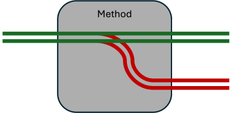
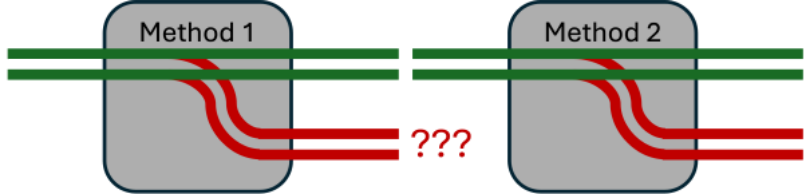
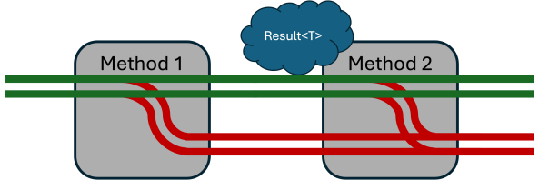
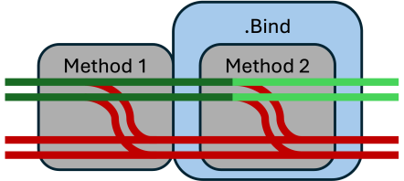
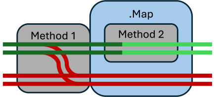
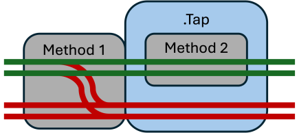

# Railway Oriented Programming
A functional approach to error handling, coined by Scott Wlaschin at NDC Oslo 2014.

## Happy path programming
Usecase: *As API client I want to create a new Account if the email address is unique.*
```
{
    // Validate request;
    // Check email address is unique
    // Create ValueObject TelephoneNumber
    // Create Account entity
    // Store Account entity
    // Return Account entity (201 Created)
}
```
**BUT that's not all**

Usecase: *As API client I want to create a new Account if the email address is unique,
and see sensible error messages when something goes wrong!*
```
{
    // Validate request;
      // If not valid return validation errors (400 Bad request)
    // Check email address is unique
      // If not unique return not unique error (409 Conflict)
    // Create ValueObject TelephoneNumber
      // If exception return error (400 Bad request)
    // Create Account entity
      // If domain exception??? return error (400 Bad request) 
    // Store Account entity (If something goes wrong here it is technical)
    // Return Account entity (201 Created)
}
```
Imperative code can return early, but the code handling errors and exceptions tends 
to obscure the happy path.

[Example Imperative CreateAccount Endpoint](../Features/CreateAccount/CreateAccountImperativeEndpoint.cs)

Using exceptions for control flow is expansive. Is an expected exception still 
an exception? Where to handle the exceptions? Global Exception Handling??? 

How can a function have more than one type of output?

## Monad's
*In functional programming, a monad is a design pattern used to encapsulate 
computations in a way that allows chaining of operations while abstracting 
away underlying details like side effects or state.*

### Either Monad 
- Purpose: Encapsulates computations that may result in a value or an error.
- Example: Used for error propagation.
- Key types:
  - Right(value) represents success.
  - Left(error) represents failure or an error message.
- Use case: Managing success or error states in a computation.

### Result of T
*Simplified*
```
public sealed record Result<TValue>
{
    private readonly TValue? _value;
    
    public bool IsSuccess { get; }
    public Error Error { get; }
    public TValue Value => IsSuccess ? _value! : throw new InvalidOperationException();
    
    private Result(TValue? value, bool isSuccess, Error error)
    {
        _value = value;
        IsSuccess = isSuccess;
        Error = error;
    }
    
    public static Result<TValue> Success<TValue>(TValue value) 
        => new(value, true, Error.None);
        
    public static Result<TValue> Failure<TValue>(Error error) 
        => new(default, false, error);
}

public record Error(string Code, string? Message = "")
{
    public static readonly Error None = new("");
}
```
[My implementation of Result\<T\>](../SharedKernel/Results/Result.cs)

What would the same CreateAccount look like using the Result\<T\> monad?

[Example Imperative CreateAccount with Result\<\T\>](../Features/CreateAccount/CreateAccountResultsEndpoint.cs)

Still a lot of windows to jump out instead of using the door....

How can you bypass downstream functions when an error happens?

If we now look at a method that returns a `Result<T>` we can see that the method can return a success or a failure. 
And it looks kind of like a railway switch. The method can go left or right.



## ROP What is it?
Railway Oriented Programming (ROP) is a functional programming pattern that is used to handle errors in a functional way.

But what to do when the first method returns an error?



!! BRILLIANT IDEA !! What if the the second function would accept a `Result<T>` as input and only execute if that result is a success? 
This is the essence of Railway Oriented Programming (ROP).



## The ROP extensions Methods
Instead of implementing the `if(IsSuccess){}` logic in every method, the ROP extensions methods can be used to chain the 
methods together.

[Example Railway Oriented CreateAccount](../Features/CreateAccount/CreateAccountRopEndpoint.cs)


### Bind
The `Bind` method is used to chain two functions that both return `Result<T>` together. The bind method takes a `Result<T>` as input and 
only executes the bound method if the result of the first method is a success. If the result is a failure, the Bind 
method will not execute the bound method and will pass on the error.



### Map
The `Map` method is used to chain two functions together, but the second function doesn't return a `Result<T>`. 
The Map method only executes the bound method if the previous result is a success. The result of the seconds method
will be returned as a `Result<T>` to be used in the rest op the chain.



### Tap
The `Tap` method is used to execute a function using the previous result or not but the result of this method is not
interesting for the continuation of the chain. The function will only be executed if the previous result is a success.



### Create
`Create` is the starting point of a ROP chain. It is used to create a `Result<T>` based on the input parameters of
the method. The `Create` method is used to create a success result. Not often necessary, because the chain often
starts with a `Result<T>` as result of another method.

### Ensure
`Ensure` is used to validate one or more boolean predicates. If one of the predicates is false, the method will return
the defined error. If all predicates are true, the method will return success as `Result<T>`. Can be used to validate
input parameters of a method and starting the chain.

### Match
The `Match` method is used at the end of the chain to handle the result of the chain. It takes two functions as input, 
and execute one of them based on the success or failure of the chain.

### Combine
The `Combine` method is used to combine multiple `Result<T>` into one `Result<T>`. The method will return a success if 
all the input `Result<T>` are a success. If one of the input `Result<T>` is a failure, the method will return the first 
error it encounters.

## ROP Refactor/Use example
- [Example Refactor Account.Create](../Domain/Account.cs)
- Add DomainEvent
- Add Update Account method

## Learnings
What have I learned from implementing the ROP pattern in my code?
- Designed with failure case in mind
- Default error handling is in place, no need to think about it
- Tells the story of the happy path
- More readable code (=debatable)
- Challenging to write at first
- Easier when you control the whole flow/chain


## References / Learn more
- [Original talk by Scott Wlaschin](https://vimeo.com/113707214)
- [Slide desk](https://www.slideshare.net/slideshow/railway-oriented-programming/32242318#98)
- [C# Functional Extensions GitHub](https://github.com/vkhorikov/CSharpFunctionalExtensions/tree/master)
- [Functional Programming With C# Using Railway-Oriented Programming - Milan Jovanović](https://www.youtube.com/watch?v=dDasAmowFts)
