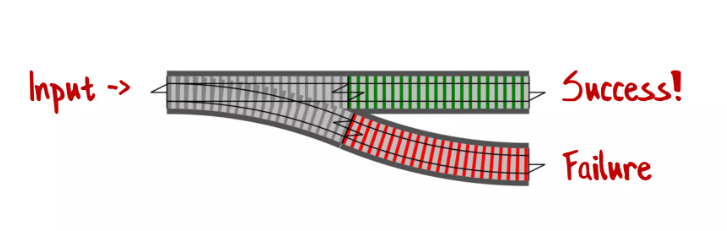

# Railway Oriented Programming
A functional approach to error handling

## Happy path programming
Usecase: *As API client I want to create a new Account if the email address is unique.*
```
{
    // Validate request;
    // Check email address is unique
    // Create ValueObject TelephoneNumber
    // Create Account entity
    // Store Account entity
    // Return Account entity (201 Created)
}
```
**BUT that's not all**

Usecase: *As API client I want to create a new Account if the email address is unique,
and see sensible error messages when something goes wrong!*
```
{
    // Validate request;
      // If not valid return validation errors (400 Bad request)
    // Check email address is unique
      // If not unique return not unique error (409 Conflict)
    // Create ValueObject TelephoneNumber
      // If exception return error (400 Bad request)
    // Create Account entity
      // If domain exception??? return error (400 Bad request) 
    // Store Account entity (If something goes wrong here it is technical)
    // Return Account entity (201 Created)
}
```
Imperative code can return early, but the code handling errors and exceptions tends 
to obscure the happy path.

Using exceptions for control flow is expansive. Is an expected exception still 
an exception? Where to handle the exceptions? Global Exception Handling??? 

How can a function have more than one type of output?

## Monad's
*In functional programming, a monad is a design pattern used to encapsulate 
computations in a way that allows chaining of operations while abstracting 
away underlying details like side effects or state.*

### Either Monad 
- Purpose: Encapsulates computations that may result in a value or an error.
- Example: Used for error propagation.
- Key types:
  - Right(value) represents success.
  - Left(error) represents failure or an error message.
- Use case: Managing success or error states in a computation.

### Result of T
*Simplified*
```
public sealed record Result<TValue>
{
    private readonly TValue? _value;
    
    public bool IsSuccess { get; }
    public Error Error { get; }
    public TValue Value => IsSuccess ? _value! : throw new InvalidOperationException();
    
    private Result(TValue? value, bool isSuccess, Error error)
    {
        _value = value;
        IsSuccess = isSuccess;
        Error = error;
    }
    
    public static Result<TValue> Success<TValue>(TValue value) 
        => new(value, true, Error.None);
        
    public static Result<TValue> Failure<TValue>(Error error) 
        => new(default, false, error);
}

public record Error(string Code, string? Message = "")
{
    public static readonly Error None = new("");
}
```


## ROP What is it?
Still a lot of windows to jump out instead of using the door....

How can you bypass downstream functions when an error happens?


## The ROP extensions Methods

### Create or Ensure
Create or Ensure is the starting point of a ROP chain. It is used to create a ResultofT or a Result 
based on the input parameters of the method.

### Bind
The Bind method is used to chain multiple functions that return ResultofT together. It takes a ResultofT as input and only executes the 
binded method if the result of the previous method is a success. If the result is a failure, the Bind method will not
execute the binded method and will only return the failure result.


### Tap or Map
The Map or Tap method is used to execute a function using the previous result or not but doesn't return a ResultofT 
itself. The function will only be executed if the previous result is a success.

### Match
The Match method is used at the end of the chain to handle the result of the chain. It takes two functions as input, 
and execute one of them based on the result of the chain.

## References / Learn more
- [Original talk by Scott Wlaschin](https://vimeo.com/113707214)
- [Slide desk](https://www.slideshare.net/slideshow/railway-oriented-programming/32242318#98)
- [C# Functional Extensions GitHub](https://github.com/vkhorikov/CSharpFunctionalExtensions/tree/master)
- [Functional Programming With C# Using Railway-Oriented Programming - Milan Jovanović](https://www.youtube.com/watch?v=dDasAmowFts)
